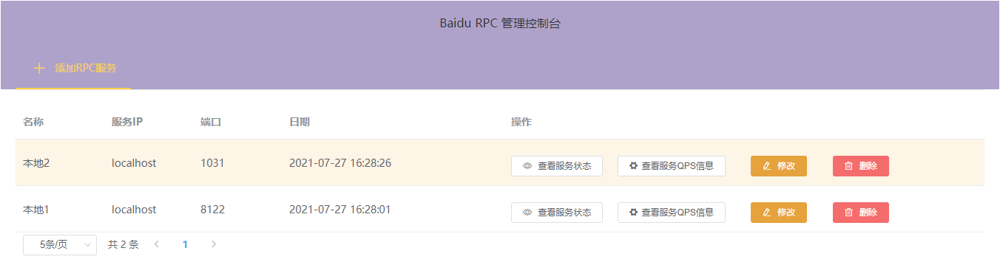
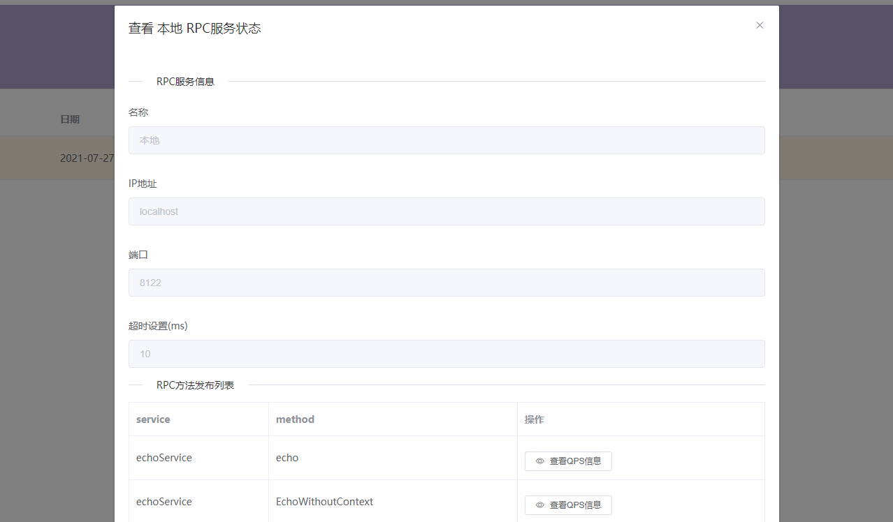
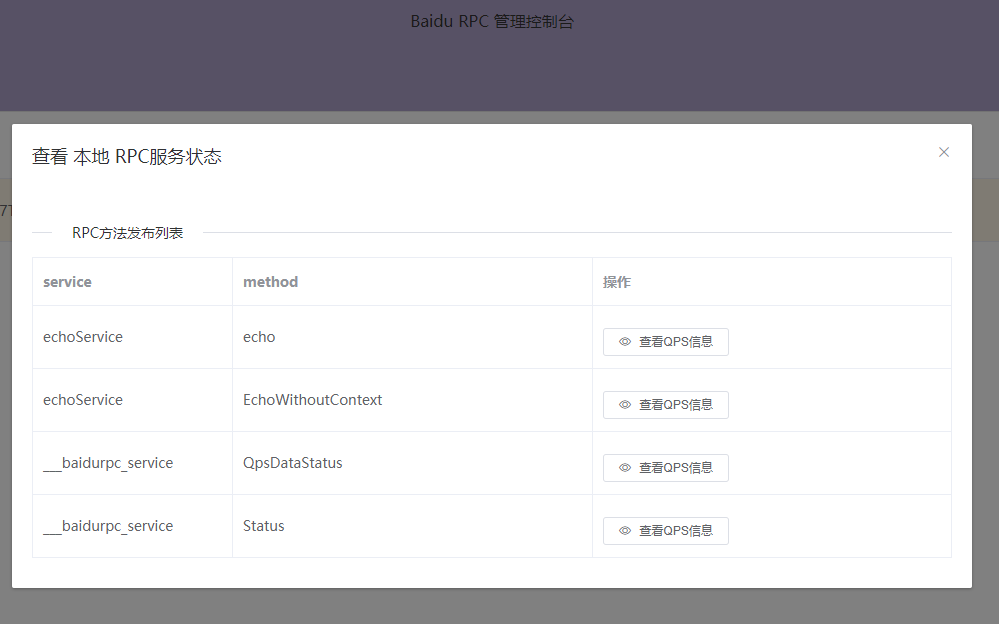
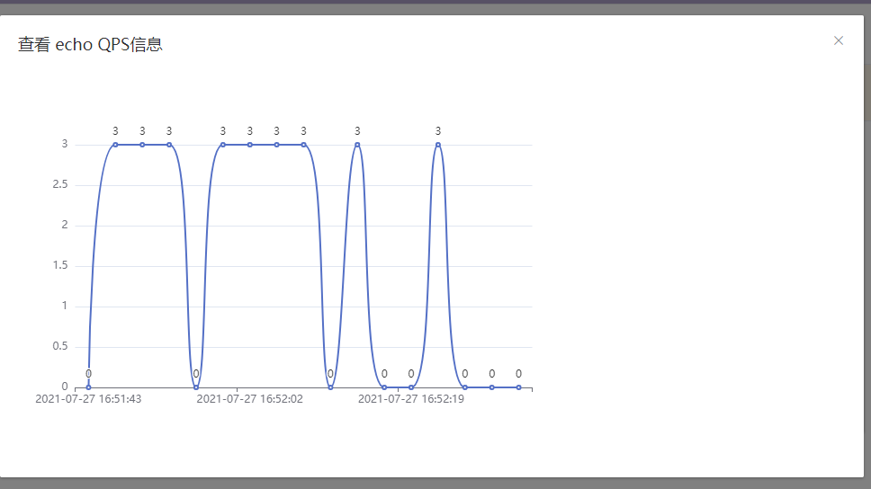

<!--
 * @Author: Malin Xie
 * @Description: 
 * @Date: 2021-07-27 16:05:59
-->

<h1 align="center">brpcweb</h1>


[](https://goreportcard.com/report/github.com/jhunters/brpcweb)
[](https://github.com/jhunters/brpcweb/actions/workflows/go.yml)
[](https://github.com/jhunters/brpcweb/releases)
[](https://godoc.org/github.com/jhunters/brpcweb)
[](https://golang.com.cn/github.com/jhunters/brpcweb)
[](https://github.com/jhunters/brpcweb/blob/master/LICENSE)
[](https://app.codeac.io/github/jhunters/brpcweb)


<p align="center">
brpcweb是专为baidurpc开发一套在线管理控制台，提供在线的服务管理功能。
想了解baidu rpc项目，请查看：[https://github.com/baidu-golang/pbrpc]
</p>


## overview picture


## Usage
### Installing 

To start using timewheel, install Go and run `go get`:

```sh
$ go get github.com/jhunters/brpcweb
```

### Start server
Change to your install directory. 
 ```sh
./brpcweb
```

###  Or Build from source
```sh
$ git clone https://github.com/jhunters/brpcweb.git
$ cd brpcweb
$ go build main.go
$ ./main -http=:1031
```
Open your browser and visit http://localhost:1031


###  More screenshot 







###  Embed web module into your baidu-rpc server 
```go
    // param1 listen address
    // param2 reqeust prefix path
    // database file store path 
	module, err := web.NewWebModule(":8080", "/", "./data")
	if err != nil {
		fmt.Println(err)
		return
	}
	defer module.Close()
    // add a rpc server from API
    module.AddRPCServer("本地", "localhost", *port)

	module.StartWeb() // 

```
### more advance usage to publish web server with the same port of rpc server<br>
[demo/rpcserver-with-web.go](demo/rpcserver-with-web.go)


## License
brpcweb is [Apache 2.0 licensed](./LICENSE).
